# Apple Platform Project Setup

Bootstrap Apple workspaces in a strict order so the repo gets the right foundation before any project-specific customization.

**Core principle:** install the baseline workflow first, then interview and specialize, then generate `AGENTS.md` after the selected skills and subagents are already in place.

**Source of truth:** This skill must follow [`catalog.yaml`](catalog.yaml), [`inventory/skills.yaml`](inventory/skills.yaml), [`inventory/subagents.yaml`](inventory/subagents.yaml), [`references/source-precedence.md`](references/source-precedence.md), [`references/codex-config.md`](references/codex-config.md), [`references/mcp-setup.md`](references/mcp-setup.md), [`references/github-actions.md`](references/github-actions.md), [`references/swiftlint-setup.md`](references/swiftlint-setup.md), and the files under [`snippets/`](snippets/).

## When to Use

Use this skill when:

- starting a new Apple platform repository or local workspace
- deciding between `SPM` and `Xcode`
- setting up `AGENTS.md`, `.codex/config.toml`, MCP, `gitlint`, `SwiftLint`, GitHub Actions, skills, or subagents for Apple development
- standardizing repository bootstrap for iOS, macOS, watchOS, tvOS, or visionOS work

Do not use this skill for:

- editing an already-established repository with stable local conventions
- non-Apple projects
- one-off repo cleanup unrelated to bootstrap

## Mandatory Order

```dot
digraph setup_order {
    rankdir=LR;
    superpowers [label="Check superpowers"];
    confirm [label="Need install or home-dir change?", shape=diamond];
    stop [label="Propose official install\nand wait for confirmation"];
    interview [label="Interview user"];
    choose [label="Choose SPM or Xcode"];
    tools [label="Check tool prerequisites"];
    install [label="Install skills / copy subagents\nwith confirmation rules"];
    config [label="Configure .codex/config.toml\nand optional MCP"];
    apply [label="Apply snippets"];
    agents [label="Create AGENTS.md\nfrom bootstrap snippet"];
    summary [label="Summarize configured vs pending"];

    superpowers -> confirm;
    confirm -> stop [label="yes"];
    confirm -> interview [label="no"];
    stop -> interview [label="after confirmation"];
    interview -> choose;
    choose -> tools;
    tools -> install;
    install -> config;
    config -> apply;
    apply -> agents;
    agents -> summary;
}
```

Never reorder these steps.

## Quick Reference

| Topic | Rule |
|---|---|
| Baseline prerequisite | `obra/superpowers` always comes first |
| AGENTS timing | generate after selected skills and subagents are installed |
| AGENTS syntax | skills as `$skill-name`, subagents as `@agent-name` |
| Selection model | recommend one best-fit option, user keeps the final choice |
| Concrete selection source | `inventory/skills.yaml` and `inventory/subagents.yaml` |
| Skill install preference | `skills.sh` first, upstream instructions second |
| Subagent install location | `.codex/agents/` by default |
| Project config | prefer project `.codex/config.toml` for skill registration and optional wrappers |
| Sosumi integration | prefer HTTP MCP; CLI is optional |
| Xcode MCP policy | only for `xcode` workspaces, never for `spm` |
| SwiftLint policy | choose the `SPM` or `Xcode` SwiftLint snippet after the workspace shape is known |
| GitHub Actions policy | every workflow keeps `workflow_dispatch`, least-privilege permissions, and concurrency |
| Global tool install policy | propose only, never auto-install |
| Project choice | decide `SPM` vs `Xcode` after interview, not before |
| Snippet application | obey `target_path`, `apply_mode`, `conflict_policy`, and `merge_strategy` from `catalog.yaml` |

## Workflow

### 1. Check baseline prerequisites

- Confirm whether `superpowers` is already installed.
- If not installed, use [`references/install-superpowers.md`](references/install-superpowers.md).
- If the step requires cloning into `~/.codex`, creating `~/.agents/skills`, changing dotfiles, or installing a global tool, stop and ask for confirmation.

**No exceptions.**

### 2. Run the project interview

- Ask questions from [`references/project-interview.md`](references/project-interview.md).
- Determine:
  - project role
  - target platforms
  - delivery shape
  - preferred UI stack
  - priority technologies
  - typed SF Symbols policy
  - testing and CI expectations
  - project `.codex/config.toml` expectations
  - optional MCP integrations
  - policy constraints

Do not choose skills, subagents, or repo files before the interview is complete.

### 3. Choose workspace type

- Use `SPM` when the project is package-first, library-first, CLI-first, or intentionally lightweight.
- Use `Xcode` when the project is app-first, uses app lifecycle targets, or depends on Xcode-managed assets and schemes.
- If the user already made a valid choice, honor it and continue.

Then use the matching snippet set:

- `SPM`: [`snippets/spm/.gitignore`](snippets/spm/.gitignore), [`snippets/spm/.swiftlint.yml`](snippets/spm/.swiftlint.yml), [`snippets/spm/workflows/build.yml`](snippets/spm/workflows/build.yml), [`snippets/spm/workflows/test.yml`](snippets/spm/workflows/test.yml)
- `Xcode`: [`snippets/xcode/.gitignore`](snippets/xcode/.gitignore), [`snippets/xcode/.swiftlint.yml`](snippets/xcode/.swiftlint.yml), [`snippets/xcode/workflows/build.yml`](snippets/xcode/workflows/build.yml), [`snippets/xcode/workflows/test.yml`](snippets/xcode/workflows/test.yml)

### 4. Check tool prerequisites

Check for:

- `npx`
- `gitlint`
- `swiftlint`
- `gh` when GitHub automation is requested
- `xcrun` when `xcode` MCP is selected for an `xcode` workspace
- `sosumi` only when the user explicitly wants the CLI
- `npx` with `mcp-remote` only when the user wants the `sosumi` stdio proxy fallback

Use [`references/tool-install-policy.md`](references/tool-install-policy.md).

If a required tool is missing:

- explain why it is needed
- propose one concrete global install command
- wait for explicit confirmation before running it

### 5. Install skills and subagents

- Follow [`references/skills-catalog.md`](references/skills-catalog.md) and [`references/subagents-catalog.md`](references/subagents-catalog.md).
- Resolve concrete choices from [`inventory/skills.yaml`](inventory/skills.yaml) and [`inventory/subagents.yaml`](inventory/subagents.yaml).
- Prefer `skills.sh` install commands whenever available.
- Fall back to upstream instructions only when `skills.sh` is not available or not supported for the selected source.
- Treat every external skills source as a catalog that may contain multiple skills, not as a single install target.
- First map the project needs to one or more capability categories such as UI, architecture, package design, testing, tooling, CI, or repository automation.
- Then map each selected category to a source catalog and resolve one concrete inventory-backed choice from that category.
- Install community skills project-locally by default under `.agents/skills/` when the installer supports it.
- If the installer only supports user-level install, explain the limitation and ask before proceeding.
- Do not install an entire catalog because its source link is relevant. Only inspect and recommend skills from the categories that match the project.
- If a category has no verified concrete entry in the inventory, do not invent one. Keep the source as a fallback recommendation path and tell the user the inventory is not seeded for that case yet.
- Copy only the chosen subagent files into `.codex/agents/`; never dump an entire external collection into the repo.
- If a source exposes multiple relevant skills or subagents, narrow them to one recommended best-fit option per capability gap.
- Explain why that recommended `$skill-name` or `@agent-name` is the strongest fit for the current repository state.
- List other relevant candidates only as alternatives with explicit `choose instead if ...` rules.
- Final selection still belongs to the user. The skill recommends; the user confirms or overrides.

### 6. Configure project `.codex/config.toml` and optional MCP

- Follow [`references/codex-config.md`](references/codex-config.md) and [`references/mcp-setup.md`](references/mcp-setup.md).
- Prefer a project-scoped `.codex/config.toml` when the repo is meant to carry its own Codex setup.
- Register the skill with `[[skills.config]]` using the installed local path.
- Use `developer_instructions` only as a thin wrapper when the repo wants a short always-on reminder.
- Use `model_instructions_file` only as an explicit alternative when the repo wants a dedicated instruction file instead of relying on `AGENTS.md`.
- Prefer `sosumi` over HTTP MCP when Apple docs lookup is desired and the client supports remote MCP servers.
- Treat the `sosumi` CLI as optional. Do not require a global CLI install when HTTP MCP already solves the need.
- Offer `xcode` MCP only when the workspace shape is `xcode`.
- Before configuring `xcode` MCP:
  - require the user to enable external agents in `Xcode > Settings > Intelligence`
  - require the project to be open in Xcode
  - use the Apple-supported `xcrun mcpbridge` integration path
- Never configure `xcode` MCP for `spm` workspaces in this skill, even if the package could be opened in Xcode manually.

### 7. Apply common artifacts

Apply or refine:

- [`snippets/common/.gitlint`](snippets/common/.gitlint)
- the selected workspace SwiftLint snippet from [`references/swiftlint-setup.md`](references/swiftlint-setup.md) when Swift source is in scope
- [`snippets/common/.swiftlint.sfsafesymbols.yml`](snippets/common/.swiftlint.sfsafesymbols.yml) only when the user chose `SFSafeSymbols`
- [`snippets/common/workflows/gitlint.yml`](snippets/common/workflows/gitlint.yml)
- the selected `.gitignore`
- the selected build and test workflows

Use [`references/github-actions.md`](references/github-actions.md) when refining the workflow snippets.

Always apply snippet-backed artifacts using the contract in [`catalog.yaml`](catalog.yaml):

- `target_path` decides where the artifact lands in the target repo.
- `apply_mode` decides whether the artifact is copied, generated from a template, or merged as a fragment.
- `conflict_policy` decides whether existing non-empty files require confirmation before replace or merge.
- `merge_strategy` is used only when the artifact is merged into an existing file.

Do not improvise target paths, overwrite behavior, or merge behavior outside that contract.

Before adding the `No raw SF Symbol strings` SwiftLint rule:

- ask whether the project should add `SFSafeSymbols` via Swift Package Manager
- use [`references/sfsafesymbols.md`](references/sfsafesymbols.md) for the install path that matches the chosen workspace shape
- select the workspace-specific `.swiftlint.yml` before merging any optional fragments
- if the user says yes:
  - add the `SFSafeSymbols` package dependency
  - merge the `snippets/common/.swiftlint.sfsafesymbols.yml` fragment into the final `.swiftlint.yml`
- if the user says no:
  - do not add the package dependency
  - do not add the `No raw SF Symbol strings` rule

### 8. Create `AGENTS.md` last

- Start from [`snippets/common/AGENTS.bootstrap.md`](snippets/common/AGENTS.bootstrap.md).
- Use **REQUIRED SUB-SKILL:** `superpowers:writing-skills` when generating or reshaping the repo-specific `AGENTS.md`.
- Do this only after:
  - the project interview is complete
  - the workspace shape is chosen
  - the selected skills and subagents are installed or intentionally skipped
  - the common repo artifacts are already applied
- Treat the bootstrap file as the starting structure for the final repo-local `AGENTS.md`, not as an early placeholder.
- Any generated `AGENTS.md` must reference skills as `$skill-name` and subagents as `@agent-name`.
- Every recommended `$skill-name` or `@agent-name` in `AGENTS.md` must include one short rule explaining when to apply it.

When refining `AGENTS.md`, use this rendering contract:

- `Recommended Skills` contains one recommended `$skill-name` per capability gap plus:
  - one short usage rule
  - one short “why this is recommended now” explanation
- `Recommended Subagents` contains one recommended `@agent-name` per capability gap plus:
  - one short usage rule
  - one short “why this is recommended now” explanation
- `Optional Alternatives` may list other relevant `$skill-name` and `@agent-name` options only with explicit `choose instead if ...` rules.
- Add one short note making it explicit that the user makes the final choice.
- Do not present multiple skills or subagents as equal defaults for the same gap.

### 9. Summarize clearly

End by separating:

- what was installed
- what was configured
- what still needs user confirmation
- what still needs project-specific decisions

## Common Mistakes

### Installing anything before `superpowers`

Wrong. This skill must establish the baseline workflow first or stop for confirmation.

### Choosing `SPM` or `Xcode` before interviewing the user

Wrong. The project role and technology priorities determine the correct shape.

### Installing missing tools automatically

Wrong. Global installs must always be user-confirmed.

### Inventing Codex config keys or paths

Wrong. Use the official `config.toml` reference and the repo config guidance documents.

### Treating external catalogs as templates

Wrong. External skills and subagents are recommendation sources. Repo truth still comes from `catalog.yaml`, `references/`, and `snippets/`.

### Installing every skill or subagent from a source

Wrong. Select the smallest relevant set after the interview.

### Treating a skills catalog link as one thing to install wholesale

Wrong. A relevant source link may contain many skills. Choose a useful category first, then recommend one concrete skill from that category.

### Guessing a concrete skill or subagent without the inventory

Wrong. Resolve verified concrete choices from `inventory/skills.yaml` and `inventory/subagents.yaml` or keep the source as an explicit fallback.

### Generating `AGENTS.md` before setup decisions are settled

Wrong. `AGENTS.md` should describe the setup that was actually chosen and installed, not a temporary guess.

### Enabling the SF Symbols lint rule without the typed symbols dependency

Wrong. The `No raw SF Symbol strings` rule only makes sense after the user accepts `SFSafeSymbols` for the project.

### Applying one shared SwiftLint snippet to both `SPM` and `Xcode`

Wrong. SwiftLint selection is shape-specific in this repository. Choose the workspace first, then apply the matching `.swiftlint.yml`.

### Listing multiple relevant skills or subagents as equal defaults

Wrong. Recommend one best-fit option for the current task and move the rest into conditional alternatives.

### Improvising snippet copy or merge behavior

Wrong. `catalog.yaml` defines the target path, apply mode, conflict policy, and merge strategy for snippet-backed artifacts.

### Treating the recommendation as the final decision

Wrong. The user still decides what to install or enable.

### Configuring `xcode` MCP for an `spm` workspace

Wrong. In this skill, `xcode` MCP is a policy-approved path only for `xcode` workspaces.

### Treating the `sosumi` CLI as required for `sosumi` MCP

Wrong. Prefer HTTP MCP first. The CLI is optional and should be suggested only when that specific path is wanted.

## Red Flags

- "I can skip `superpowers` because the user only asked for SwiftLint."
- "I already know this is an Xcode project."
- "I'll install `gitlint` first and ask later."
- "I'll install all suggested subagents now and clean up later."
- "This `skills.sh` link is relevant, so I should install the whole catalog."
- "I can infer the right skills without asking about the project."
- "I'll list three relevant skills and let the client decide without a recommendation."
- "I picked the best option, so the user does not need to decide anymore."
- "I can enable the SF Symbols string rule now and decide about typed symbols later."

**All of these mean: stop and return to the mandatory order.**

## Rationalization Counter Table

| Excuse | Reality |
|---|---|
| "This repo only needs one config file, so I can skip the bootstrap." | The bootstrap still matters because `AGENTS.md` must capture the final chosen setup, not a guess. |
| "I know which skills Apple projects usually need." | This skill must personalize recommendations after the interview, not before. |
| "The install is harmless, so I can do it without asking." | Any global install or user-home change requires explicit confirmation. |
| "The upstream repo is enough; I do not need local snippets." | This repo stores the canonical snippets and policies the skill must apply. |
| "The source link looks relevant, so I can install everything it exposes." | External skill links are catalogs. Choose a category first, then one concrete skill. |
| "All three skills are relevant, so I should list all three as peers." | Recommend one best-fit option and keep the others as conditional alternatives. |
| "I already recommended the best skill, so I can decide for the user." | The skill recommends one; the final decision stays with the user. |
| "Typed SF Symbols are a pure lint concern, so I can enable the rule without asking." | Ask about `SFSafeSymbols` first. Add the rule only if the dependency is accepted. |

## Example

User request:

> Set up a new Apple workspace for a UIKit-heavy iOS app with strict repo conventions.

Correct response shape:

1. Check whether `superpowers` is present.
2. If missing, propose the official install and wait.
3. Ask about platform targets, repo role, UI stack, testing, and CI expectations.
4. Choose `Xcode`.
5. Check `npx`, `gitlint`, `swiftlint`, and optionally `gh`, `xcrun`, or `sosumi` based on the chosen integrations.
6. Ask whether typed SF Symbols should use `SFSafeSymbols`.
7. Recommend one best-fit `$skill-name` and one best-fit `@agent-name` where needed, each with a short usage rule and rationale.
8. Ask the user to confirm the final selection when multiple candidates are relevant.
9. Install or copy only the confirmed skills and subagents.
10. Configure project `.codex/config.toml` and any approved MCP servers.
11. If the user accepted `SFSafeSymbols`, add that package dependency and merge the SF Symbols SwiftLint rule.
12. If the workspace is `Xcode` and the user wants Xcode tools, configure `xcode` MCP through `xcrun mcpbridge`.
13. Apply common snippets plus the `Xcode` snippets, including the `Xcode` SwiftLint snippet and normalized workflow guardrails.
14. Generate the repo-specific `AGENTS.md` from the bootstrap snippet.
